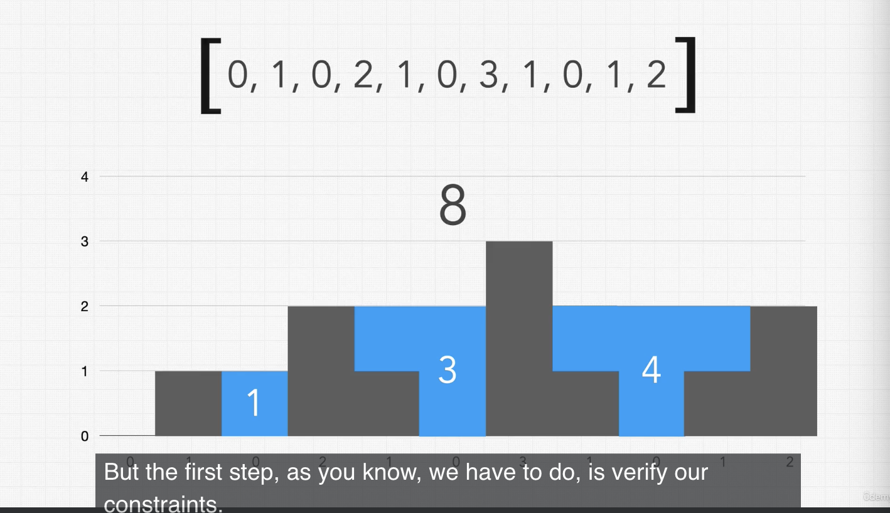

### Question

Given an array of integers representing an elevation map where the width of each bar is 1, return how much rain water can be trapped.

### Example

Input:
[0, 1, 0, 2, 1, 0, 3, 1, 0, 1, 2] (array)



Output:
`8 * 3 = 24`

### Step 1. Constraint Questions:

-   Do the left and right sides of the graph count as walls? `No, the sides cannot be used to form a container`
-   Will there be negative integers? `No, assume all integers are positive.`

### Step 2. Test Cases:

```
Input:
[7,1,2,3,9] (array)

Length = 7
Width = 4 (Index 4 - Index 0)

Output:
28
```

```
Input:
[0] (array)

Output:
0
```

```
Input:
[7] (array)

Length = 7

Output:
0
```

```
Input:
[6,9,3,4,5,8] (array)
t = 5 (target)

6 * 5 = 30
8 * 4 = 32

Output:
32
```

### Step 3. Figure out a solution without code.

## Approaches.

-   **Brute force**: Try every possible solution until you find the correct answer.
    -   `O(N^2), S(1)`
-   ## **Optimized** : Shifting Pointers Technique
