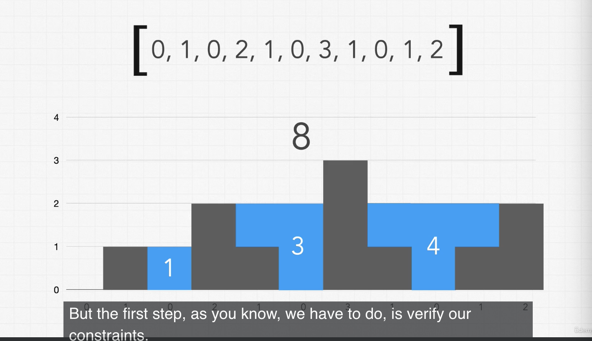

### <a href="https://leetcode.com/problems/trapping-rain-water/">Trapping Rainwater</a>

Given an array of integers representing an elevation map where the width of each bar is 1, return how much rain water can be trapped.

### Example

Input:
[0, 1, 0, 2, 1, 0, 3, 1, 0, 1, 2] (array)



Output:
1 + 3 + 4 = `8`

### Step 1. Constraint Questions:

-   Do the left and right sides of the graph count as walls? `No, the sides cannot be used to form a container`
-   Will there be negative integers? `No, assume all integers are positive.`

### Step 2. Test Cases:

```
Input:
[0, 1, 0, 2, 1, 0, 3, 1, 0, 1, 2] (array)

Length = 7
Width = 4 (Index 4 - Index 0)

Output:
8
```

```
Input:
[0] (array)

Output:
0
```

```
Input:
[3] (array)

Output:
0
```

```
Input:
[3, 4, 4] (array)

Output:
0
```

### Step 3. Figure out a solution without code.

Input: [0, 1, 0, 0, 2, 0, 2]

Output: 2 + 2 = 3

Logic:

```
sum = 0
left  = 0
right = 0
currentWindow = 0

while right < input.length:
    middle = input[right - 1]
    leftPeak = left - middle
    rightPeak = right - middle

    if (leftPeak < 0) {
        left++;
        right++;
    } else if (leftPeak > 0 && rightPeak > 0) {

    }

```

## Approaches.

-   **Brute force**: Try every possible solution until you find the correct answer.
    -   `O(N^2), S(1)`
-   ## **Optimized** : Shifting Pointers Technique
